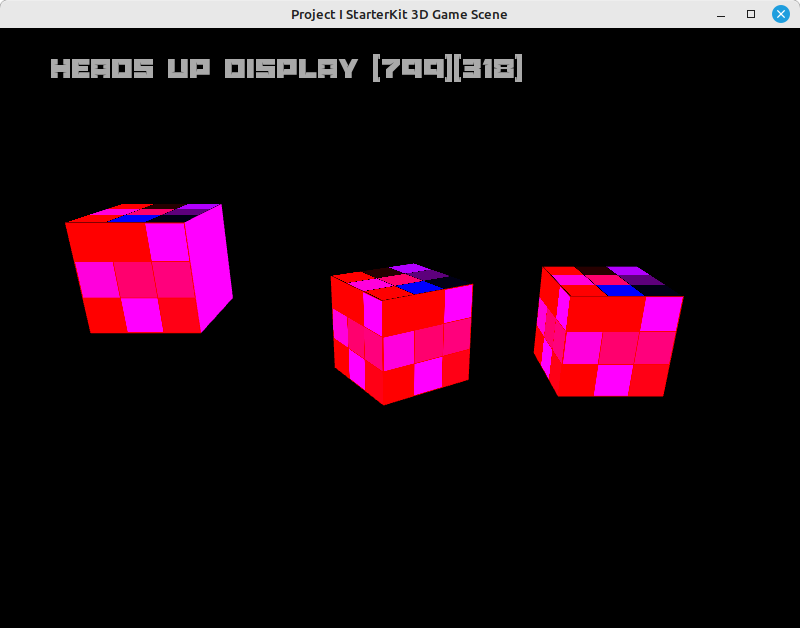

# README #

The Project I StarterKit provides a foundational framework from which students can initiate the creation of a 3D Gameplay Scene. Throughout the preceding months, we've developed numerous applications. This particular project encompasses the creation of a Cube, Vertex, and Fragment Shaders, Texture, and leverages the GLM Math Library for transformation operations. Essentially, it represents a fully realized 3D cube project with rotational capabilities. You're encouraged to personalize this example by exploring and implementing the rotate, scale, and translate functions available in the GLM Math Library. For detailed documentation on these functions, refer to [Matrix transform functions](https://glm.g-truc.net/0.9.2/api/a00245.html#ga4683c446c8432476750ade56f2537397)

### What is this repository for? ###

* Lab Experiment with a Cube Texturing all sides.

### How do I get set up? ###

* Clone repository

### Cloning Repository ###
* Run GitBash and type the Follow commands into GitBash

* Check Present Working Directory `pwd`

* Change to the C drive or other drive `cd c:`

* Make a projects Directory `mkdir projects`

* Change to the projects directory by `cd projects`

* Clone the project

* Change to the project directory

* List files that were downloaded `ls`

### Getting Started Windows ###
* Install MYSYS2 https://www.msys2.org/
* `pacman -S make` => Makefiles
* `pacman -S git` => using git commands
* `pacman -S mingw-w64-ucrt-x86_64-gcc` => compile or cpp into a exe or bin
* `pacman -S mingw-w64-ucrt-x86_64-sfml` => SFML SDK install
* `pacman -S mingw-w64-ucrt-x86_64-glew` => GLEW OpenGL Wrangler. FreeGLUT can be used as an alternative to GLEW 
http://freeglut.sourceforge.net 
* `pacman -S mingw-w64-ucrt-x86_64-glm` => GLM Math Library
* `pacman -S doxygen doxygen-latex graphviz` => Generate Code Documentation
* Run this terminal `C:\msys64\ucrt64.exe`
* git clone repo
* run make in MYSYS2 terminal
* Generate project documents using `make docs`

### Getting Started Linux (DEB) ###
* `sudo apt install make` => Makefiles
* `sudo apt install git` => using git commands
* `sudo apt-get install build-essential` => compile or cpp into a exe or bin
* `sudo apt-get install libsfml-dev` => SFML SDK install
* `sudo apt-get install libglew-dev` => GLEW OpenGL Wrangler. FreeGLUT can be used as an alternative to GLEW 
http://freeglut.sourceforge.net 
* `sudo apt install libglm-dev` => GLM Math Library
* `sudo apt install doxygen doxygen-latex graphviz` => Generate Code Documentation
* git clone repo
* run make in terminal
* Generate project documents using `make docs`

### Running StarterKit ###
* use arrow keys to rotate Player Cube, WASD for NPC and Number Keys for Boss
 
 

### Who do I talk to? ###

* philip.bourke@setu.ie
